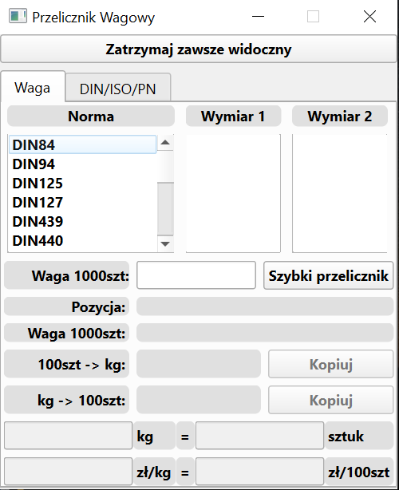
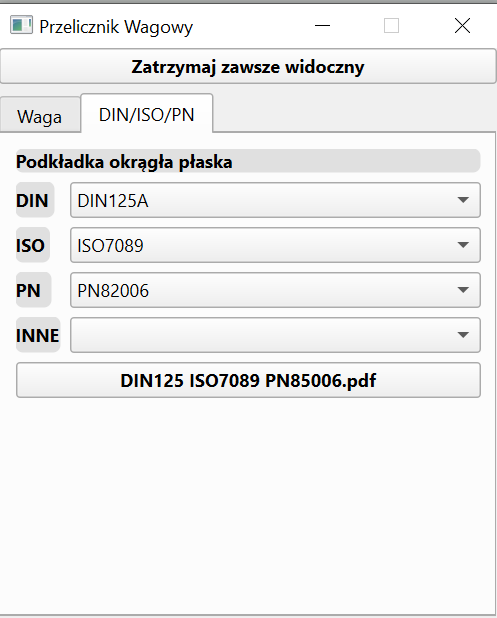

  
# Weight calculator for fasteners industry
Simple calc app which converts kilograms to pieces and price for the kilogram to price for 100 pieces.
### Presentation
* [YouTube movie presentation](https://youtu.be/Jvrw1lSTFWY)

  

## Technologies
* Python 3.10
* GUI library (PyQt6)
* SQLite
* OOP
* Test framework (PyTest)
* CI - Git Actions

## BIG PICTURE
In the fastener industry, each company use its own unit system. Sometimes we received price for 100 pieces, sometimes for 1 kilogram etc. This program was created to solve this problem. Now the office employees can easily and fast compare many offers from a different company.

## Instruction
  1. git init
  2. git remote add origin <https>
  3. git pull origin master
  4. python -m venv venv <!-- for python 3.10 --> 
  5. pip install --upgrade pip
  6. pip install -r requirements.txt
  7. pip install -e .
  8. Add at the begining of the file this line 
     1. #! C:\Python\Python38\python.exe
     2. #! "abs path to pathon" <-choose path to venv python  

## Nice links
[Good Integration Practices](https://docs.pytest.org/en/latest/explanation/goodpractices.html)  
[Packaging a python library](https://blog.ionelmc.ro/2014/05/25/python-packaging/#the-structure)  
[Automated Testing in Python with pytest, tox, and GitHub Actions](https://www.youtube.com/watch?v=DhUpxWjOhME&t=1100s)  
[Elegant Automation Frameworks with Python and Pytest](https://www.udemy.com/course/elegant-automation-frameworks-with-python-and-pytest/learn/lecture/11772944#overview)

